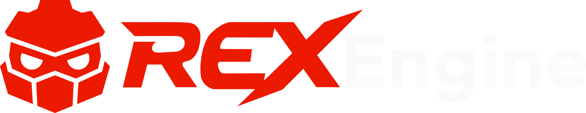

	

---

# Welcome to ReX
Welcome to the Redot owned ReX GitHub Organization! This organization aims to drive the Redot community forwards through the development of a modern open source game engine we can be proud to call our own. ReX is dedicated to pushing the boundaries of what’s possible with open source game engine technology and supporting a comunity of like minded developers focused purely on the art of game developmet.

## ReX isn't Experimental 
ReX is a new begining for the Redot community. A place for developing the next generation of open source game development tools, a place many of you were expecting when the comunity was first founded. While Redot Engine focuses on compatibility with the Godot ecosystem ReX is free to branch out and drive inovation in ways that just arent possible while following in Godot's footsteps. 

## Breaking Compatibility 
Breaking compatibility with Godot enables us to innovate freely. It isn't a bug or an unintended side effect. Existing projects may be hard to migrate or require adaptation to work with ReX. While we have every intent to make this process as seemless as posible we can't account for every edge case. If you require direct compatability without the hassle please visit [Redot Engine](https://github.com/Redot-Engine/redot-engine) Redot's Godot compatible engine.

---

	

# ReX Engine Focus
Here, you’ll find bold changes to the engine that are unrestricted by the need for compatibility. Projects here might include major UI overhauls, the integration of new physics engines, or even long-awaited features like an addon managment system, or project management and creation from templates within the engine launcher. These ideas, which may not currently align with Redot Engine's roadmap, can find a home here in ReX.

## Building a Community-Driven Team
The Redot team is committed to delivering updates and bug fixes to [Redot Engine](https://github.com/Redot-Engine/redot-engine), while ReX is looking to grow a new team of enthusiastic developers at all skill levels. This team’s goal is to push the boundaries of what’s possible for Redot and its community. Our aim is to show the broader game development community that the Redot community is more than just a Godot fork. ReXl will be a platform to showcase our commitment to innovation and reliability, inspiring developers and leading the way for open source game development tooling.

## Developing Procedures and Standards
ReX is setting a foundation for establishing structured development processes that support rapid integration of new features and quality outcomes. Our aim is to ensure that all contributors, from beginners to experts, can participate effectively. Here are the key areas of focus for ReX procedures:

- **Workflow and Contribution Guidelines:**
We’re establishing clear guidelines for contributing code, reporting issues, and proposing new features. These processes are designed to make development accessible for all contributors, creating a smooth and collaborative environment for experimentation.

- **Testing and Quality Assurance:**
 New features and independent development often brings new bugs and challenges, ReX no longer has an upstream project to rely on, so we’re implementing robust testing and quality assurance practices. This includes automated testing through GitHub Actions, in-depth code reviews, and regular experimental releases, which help maintain stability even with faster feature integration.

- **Documentation Standards:**
Thorough documentation is essential as we introduce new features and ideas. This includes technical documentation for developers, user guides for new features, and internal guidelines outlining development standards. Investing in documentation now will ease the development process for ReX and make acomplishing its future goals easier.

- **Feature Validation:**
Not every feature from ReX will make it into Redot Engine. Here, we validate the viability and impact of features through cycles of feedback and iteration. This helps us ensure that only proven and well-supported features become candidates for integration into redot engine.

- **Community Engagement and Feedback:**
  Community feedback is essential for guiding the direction of ReX. We'll actively engage with developers and users, gathering input on features and workflows. This feedback loop helps us adapt our approach based on real-world use cases and community needs.

By developing and refining these procedures, ReX is laying the groundwork for Redot’s future as an innovative, community-driven platform. We’re fostering an ecosystem where creativity and technical excellence can thrive, backed by a structured development process and shared vision.

Welcome to ReX.
