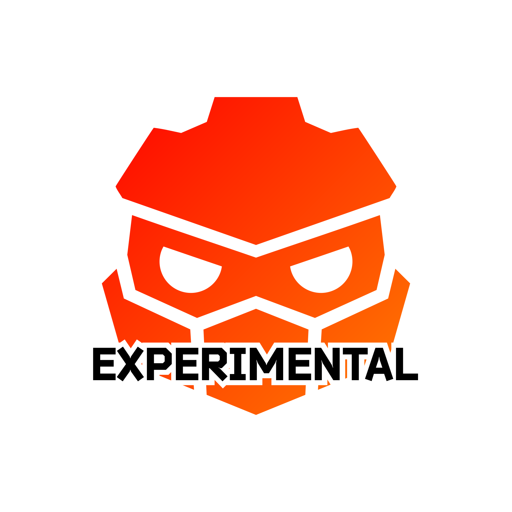

	

---

# Welcome to Redot Experimental
Welcome to the Redot Experimental GitHub Organization! This organization is the experimental counterpart of the main [Redot Engine](https://github.com/Redot-Engine/redot-engine) project, dedicated to pushing the boundaries of what’s possible within open source game engine technology. While the main project strives to maintain compatibility with Godot, Redot Experimental explores new ideas, features, and technologies free from compatibility constraints.

# Why Experimental?
Redot Experimental exists to explore innovations that may not yet be possible within the main [Redot Engine](https://github.com/Redot-Engine/redot-engine) project. Here, we can try out new tools, introduce cutting-edge changes, and test features that may one day enhance Redot Engine or even serve as standalone solutions. Our focus on experimentation enables rapid iteration, supporting a community of developers who are passionate about the future of open source game engine technology.

## Breaking Compatibility
Breaking compatibility with Godot enables us to innovate freely, though it also means that porting projects from Godot to Redot Experimental may require more adaptation. While the main [Redot Engine](https://github.com/Redot-Engine/redot-engine) project continues to support compatibility, Redot Experimental is a place to explore beyond those boundaries. This project isn’t meant to replace Redot Engine - it’s a testing ground where new features and systems can be developed in preparation for a future where compatibility is no longer a goal.

---

	

# Redot Experimental Focus
Here, you’ll find bold changes to the engine that are unrestricted by the need for compatibility. Projects here might include major UI overhauls, the integration of new physics engines, or even long-awaited features like an addon managment system and C++ project creation within the engine. These ideas, which may not currently align with the main [Redot Engine](https://github.com/Redot-Engine/redot-engine) roadmap, can find a home here in Redot Experimental.

## Building a Community-Driven Team
The core team is committed to delivering updates and bug fixes to the main [Redot Engine](https://github.com/Redot-Engine/redot-engine) project, while Redot Experimental is looking to grow a new team of enthusiastic developers at all skill levels. This team’s goal is to push the boundaries of what’s possible for Redot and its community. Our aim is to show the broader game development community that Redot is more than just a Godot fork. Redot Experimental will be a platform to showcase our commitment to innovation and reliability, inspiring developers to trust and collaborate with Redot.

## Developing Procedures and Standards
Redot Experimental serves as a foundation for establishing structured development processes that support rapid integration of new features and quality outcomes. Our aim is to ensure that all contributors, from beginners to experts, can participate effectively. Here are the key areas of focus for development within Redot Experimental:

- **Workflow and Contribution Guidelines:**
We’re establishing clear guidelines for contributing code, reporting issues, and proposing new features. These processes are designed to make development accessible for all contributors, creating a smooth and collaborative environment for experimentation.

- **Testing and Quality Assurance:**
 Experimentation often brings new bugs and challenges, so we’re implementing robust testing and quality assurance practices. This includes automated testing through GitHub Actions, in-depth code reviews, and regular experimental releases, which help maintain stability even with faster feature integration.

- **Documentation Standards:**
Thorough documentation is essential as we introduce new features and ideas. This includes technical documentation for developers, user guides for new features, and internal guidelines outlining development standards. Investing in documentation now will ease the transition into a standalone engine in the future.

- **Feature Validation:**
Not every feature from Redot Experimental will make it into the main Redot Engine. Here, we validate the viability and impact of experimental features through cycles of feedback and iteration. This helps us ensure that only proven and well-supported features become candidates for integration into the main engine or Redot’s independent future.

- **Community Engagement and Feedback:**
  Community feedback is essential for guiding the direction of Redot Experimental. We'll actively engage with developers and users, gathering input on experimental features and workflows. This feedback loop helps us adapt our approach based on real-world use cases and community needs.

By developing and refining these procedures, Redot Experimental is laying the groundwork for Redot Engine’s future as an innovative, community-driven platform. We’re fostering an ecosystem where creativity and technical excellence can thrive, backed by a structured development process and shared vision.

